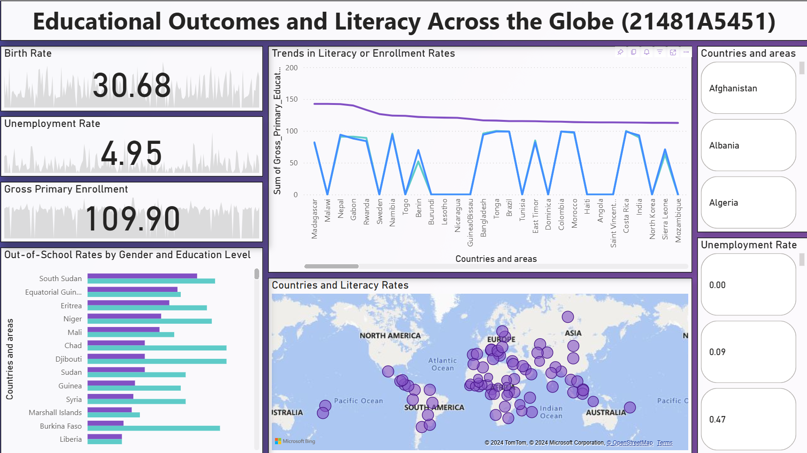

# Educational Outcomes and Literacy Across the Globe

This repository contains a Power BI dashboard project exploring educational outcomes and literacy rates across various countries. The project includes data preprocessing, analysis, and a detailed visualization using Power BI.

## Project Overview

- **Data Preprocessing**: The Jupyter notebook (`analysis.ipynb`) contains steps for cleaning, preprocessing, and analyzing the `Global_Education.csv` dataset, covering global education and literacy statistics.
- **Power BI Dashboard**: The Power BI file (`Educational Outcomes and Literacy Across the Globe.pbix`) provides interactive visualizations and insights into the educational landscape across different countries, highlighting trends and key metrics.
- **Report**: A detailed analysis of the dataset is documented in `Dataset Report.pdf`, which discusses key findings and insights.

## How to Use

1. **Data Preprocessing**: Open the `analysis.ipynb` notebook to explore the preprocessing and data analysis steps.
2. **Visualization**: Use Power BI to open the `Educational Outcomes and Literacy Across the Globe.pbix` file and interact with the dashboard.
3. **Report**: Read `Dataset Report.pdf` for a detailed understanding of the dataset and analysis.

## Dataset

The dataset (`Global_Education.csv`) contains global data on educational outcomes and literacy rates.

## Dashboard

